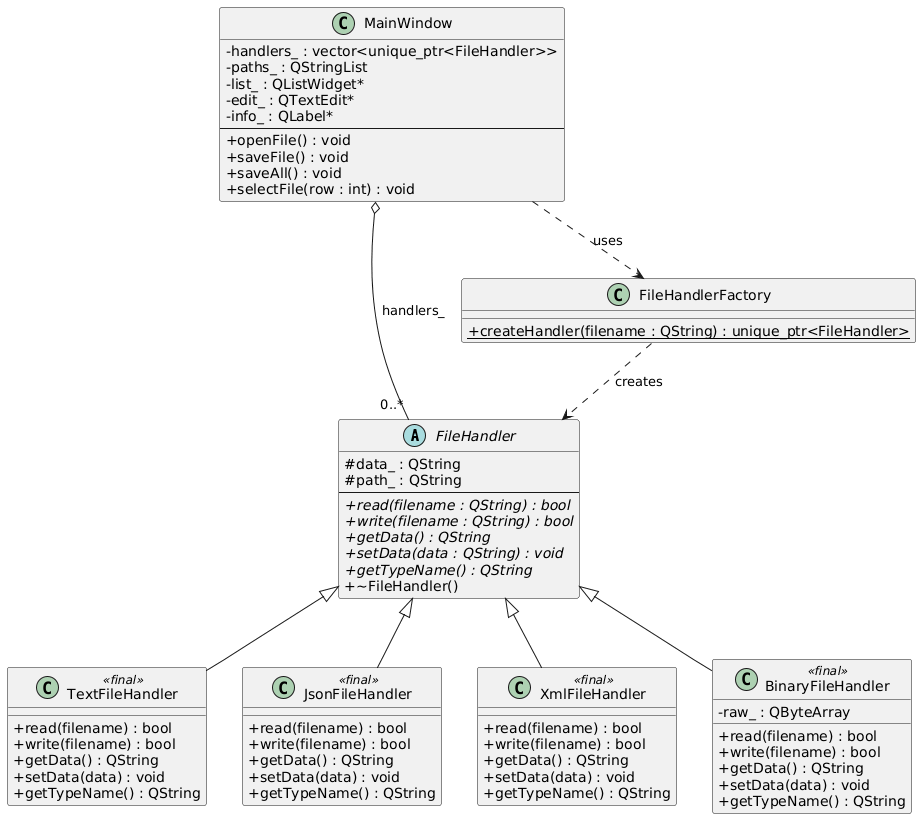

| Класс | Назначение |
|-|-|
| FileHandler | Абстрактный базовый класс. Интерфейс |
| TextFileHandler, JsonFileHandler, XmlFileHandler, BinaryFileHandler | Конкретные реализации для конкретных типов файлов |
| FileHandlerFactory | Фабрика для FileHandler-ов (в зависимости от типа конструирует) |

Полиморфизм в MainWindow с использованием указателей на абстрактные FileHandler, под капотом являющийся чем-то конкретным.

Иерархия:

